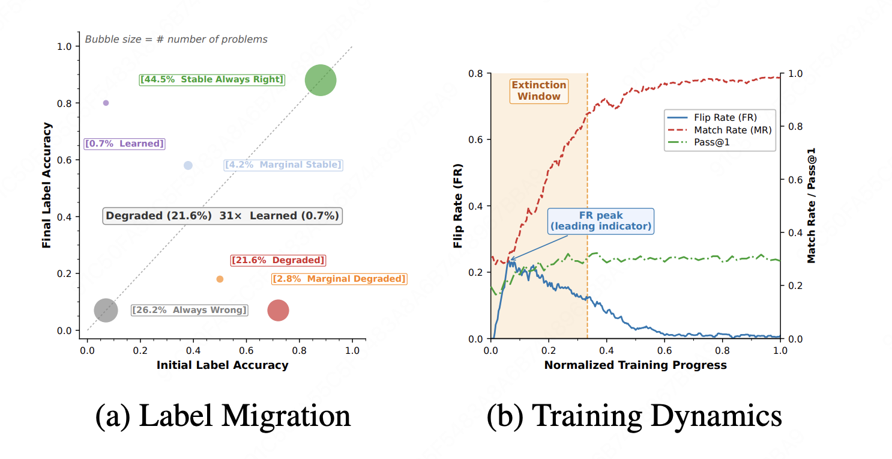
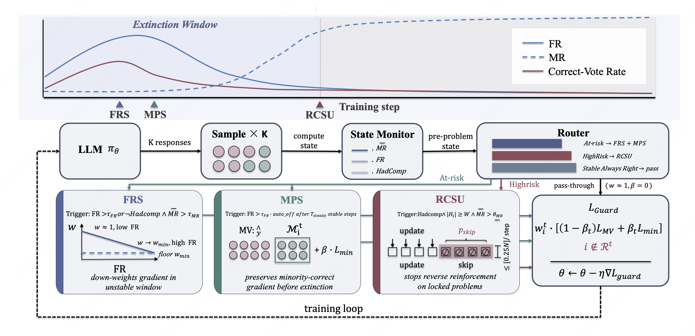
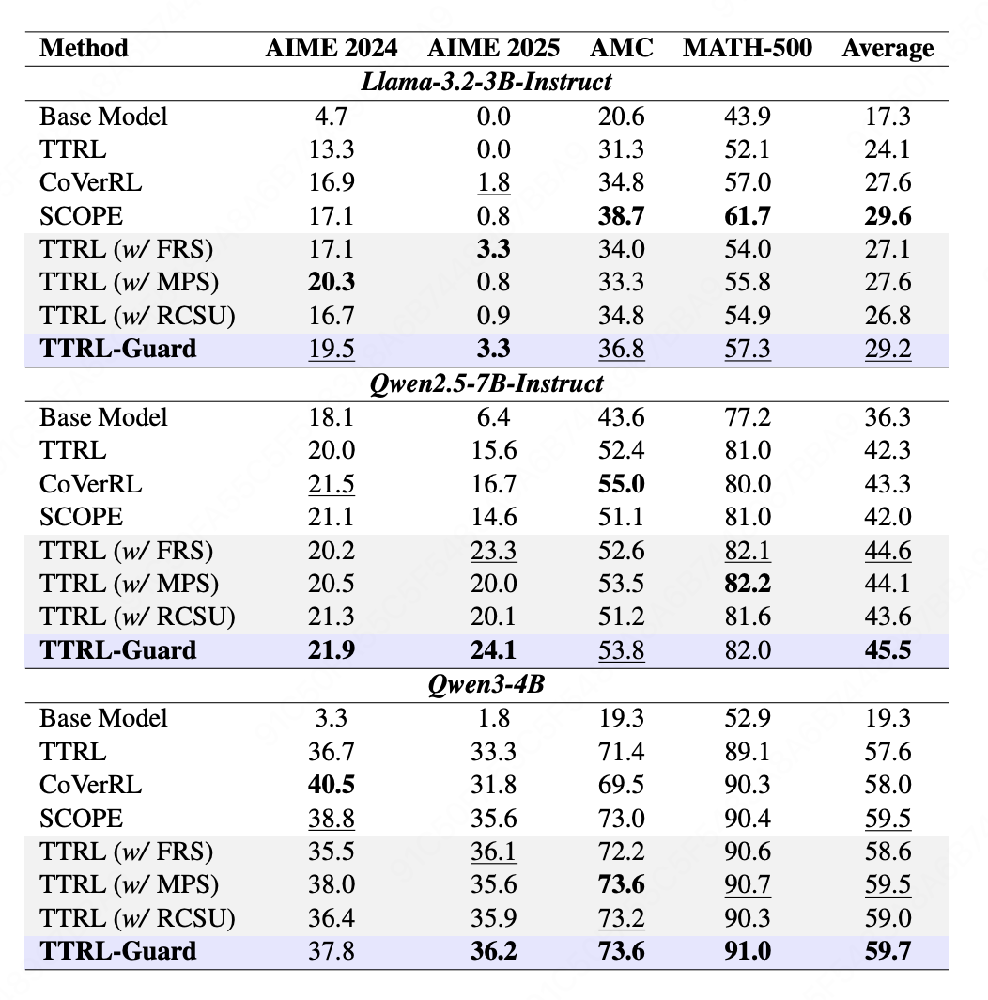

<div align="center">

# When the Majority Votes Wrong, the Intervention Timing for Test-Time Reinforcement Learning Hides in the Extinction Window

</div>


<div align="center" style="font-family: Arial, sans-serif;">
  <p>
    <a href="#introduction" style="text-decoration: none; font-weight: bold;">📖 Introduction</a> •
    <a href="#method" style="text-decoration: none; font-weight: bold;">🔍 Method</a> •
    <a href="#main-results" style="text-decoration: none; font-weight: bold;">📊 Main Results</a>
  </p>
  <p>
    <a href="#getting-started" style="text-decoration: none; font-weight: bold;">✨ Getting Started</a>
  </p>
</div>

## 📖 Introduction

RLVR has powered recent breakthroughs in LLM reasoning, but its reliance on ground-truth labels poses a fundamental scalability ceiling. [TTRL](https://arxiv.org/abs/2504.16084) addresses this by using majority voting (MV) over sampled rollouts as pseudo-labels, enabling self-improvement without human annotation. Yet a critical question remains: **Are these models truly learning to reason, or merely learning to agree with themselves?**

We conduct a per-problem trajectory analysis across three models and two benchmarks, classifying problems by their Initial Label Accuracy (ILA) and Final Label Accuracy (FLA). As shown below, **44.5% of problems are already solvable before training**, and TTRL merely sharpens their pass@k toward 1.0. Genuine zero-to-one capability acquisition accounts for a negligible **0.7%**. Meanwhile, **21.6% of initially solvable problems suffer accuracy drops** during training, a phenomenon we term **Asymmetric Degradation**: problems corrupted from correct to incorrect outnumber genuinely learned ones by 31×.

<p align="center">
   
</p>

We trace pseudo-label dynamics via two signals: the **Flip Rate (FR)**, measuring the fraction of problems whose majority-vote answer changes between consecutive steps, and the **Match Rate (MR)**, measuring the fraction of problems where the majority-vote answer matches the ground truth. FR rises sharply in early training while correct answers still hold the majority vote; as false consensus solidifies, FR collapses and MR locks in the wrong answer. We formalize this brief opportunity as the **Correct-Answer Extinction Window**: once FR decays past a critical threshold, the pseudo-label cannot be recovered.

## 🔍 Method

TTRL-Guard comprises three complementary components, all driven by **Flip Rate (FR)** and **Majority Ratio (MR)**, two unsupervised statistics computed from the majority-vote signal:

- **FRS (Flip-Rate-Aware Reward Scaling)**: Down-weights training samples during high-flip-rate periods to reduce the influence of unstable reward signals. Applies an additional penalty in the pathological case where high MR coexists with high FR (contradictory confidence), and gently suppresses prompts that have been consistently locked without ever showing competition (suspected wrong steady-state).

- **MPS (Minority-Preserving Sampling)**: During high-flip-rate periods, identifies minority answers with sufficient vote support and adds a small positive advantage bonus to samples producing those answers. This delays the premature collapse of a potentially correct minority answer before the majority vote has stabilised.

- **RCSU (Risk-Conditioned Sparse Updating)**: Identifies high-risk prompts (those that once exhibited answer competition but have since re-locked at high confidence) and stochastically skips their gradient updates. This prevents the model from over-fitting to potentially wrong majority labels on already-decided prompts.

The combined objective is:

$$\mathcal{L}_{\text{Guard}} = \sum_{i \notin \text{HighRisk}} w_i \cdot \left[ (1 - \beta_t) \cdot \mathcal{L}_{\text{MV}}(q_i) + \beta_t \cdot \mathcal{L}_{\text{minority}}(q_i) \right]$$

where $w_i$ is the FRS weight, $\beta_t$ is the MPS bonus coefficient, and HighRisk is the RCSU-identified set.

<p align="center">
   
</p>

## 📊 Main Results

TTRL-Guard consistently improves over the TTRL baseline across models and benchmarks. Results report `pass@1` (%) on held-out test sets across three models (Llama-3.2-3B-Instruct, Qwen2.5-7B-Instruct, Qwen3-4B) and four benchmarks (AIME 2024, AIME 2025, AMC, MATH-500).

<p align="center">
   
</p>

## ✨ Getting Started

### Environment Setup

```bash
git clone <this-repo>

cd TTRL-Guard/verl

conda create -n ttrl_guard python==3.10
conda activate ttrl_guard
bash scripts/install_ttrl_deps.sh
pip install -e .
```

> [!NOTE]
> The dependency installation script `scripts/install_ttrl_deps.sh` installs verl and its required packages (vLLM, Ray, FlashAttention, etc.). For further details regarding the verl training framework, please refer to the [verl documentation](https://verl.readthedocs.io/en/latest/index.html).

### Data Preparation

Use the preprocessing script to convert data from JSON to Parquet format, then update `DATA_LOCAL_DIR` in the shell scripts accordingly:

```bash
python verl/data/preprocess.py
```

### Run TTRL-Guard

Before running, set the two path variables at the top of each script:

```bash
DATA_LOCAL_DIR="path/to/TTRL-Guard/verl/data"   # directory containing .parquet files
BACKBONE_PATH="path/to/<model-name>"              # local HuggingFace model checkpoint
```

Scripts for all model × benchmark combinations are provided under `verl/examples/ttrl/`.

Example: AIME 2024 with Qwen2.5-7B-Instruct (FRS + MPS + RCSU):

```bash
bash examples/ttrl/Qwen2.5-7B-Instruct/aime24_guard.sh
```

Example: AIME 2024 with Llama-3.2-3B-Instruct (MPS + RCSU):

```bash
bash examples/ttrl/Llama-3.2-3B-Instruct/aime24_guard.sh
```

*All experiments were conducted on 8 × NVIDIA A100 80GB GPUs.*

